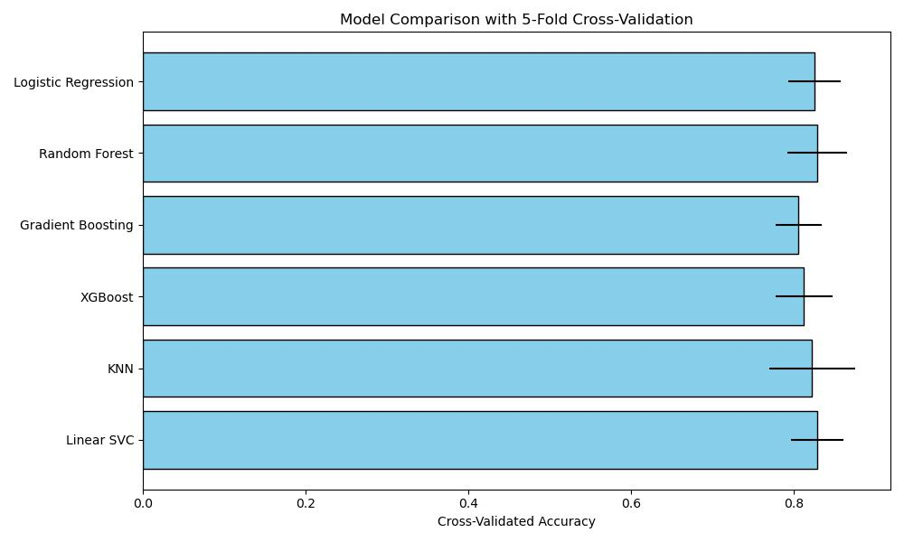

❤️ Heart Disease Prediction Web App

An interactive machine learning application to predict the risk of heart disease using clinical data — powered by a trained Random Forest model and built with Streamlit.

🔗 Live Demo: https://your-streamlit-url.streamlit.app
📁 GitHub Repo: https://github.com/yourusername/heart-disease-predictor

🚀 Features

    🔍 Predicts heart disease risk using 13 clinical indicators

    📈 Displays risk level with probability score

    🎨 Clean, interactive UI with integrated visuals

    📊 Shows feature distribution (bar plot) to aid understanding

    💾 Built with Random Forest and deployed via Streamlit Cloud

🧠 Technologies Used

    Python, NumPy, Pandas

    scikit-learn, Joblib

    Streamlit (v1.34)

    Matplotlib, Seaborn

    PIL (for image handling)

🖼️ Screenshots

Main screen of the deployed prediction app
📊 Feature Distribution Plot

Bar plot showing the distribution of clinical features from the training dataset

📋 How to Use (Run Locally)

    Clone the repo
    git clone https://github.com/yourusername/heart-disease-predictor.git
    cd heart-disease-predictor

   Install the requirements
    pip install -r requirements.txt

   Run the app
    streamlit run app.py

🔍 Input Features

    Age, Sex, Chest Pain Type (cp)

    Resting Blood Pressure (trestbps), Cholesterol (chol)

    Fasting Blood Sugar (fbs), Resting ECG (restecg)

    Max Heart Rate (thalach), Exercise Angina (exang)

    ST Depression (oldpeak), ST Slope, Major Vessels Colored (ca), Thalassemia

🧪 Model Details

    Algorithm: Random Forest Classifier

    Training Accuracy: ~85–90%

    Trained on the UCI Heart Disease dataset

    Serialized with joblib: best_rf_model.pkl

Made with ❤️ by Rupankar Mondal
Let’s connect on [LinkedIn](https://www.linkedin.com/in/rupankar-mondal-931bbb259/)

